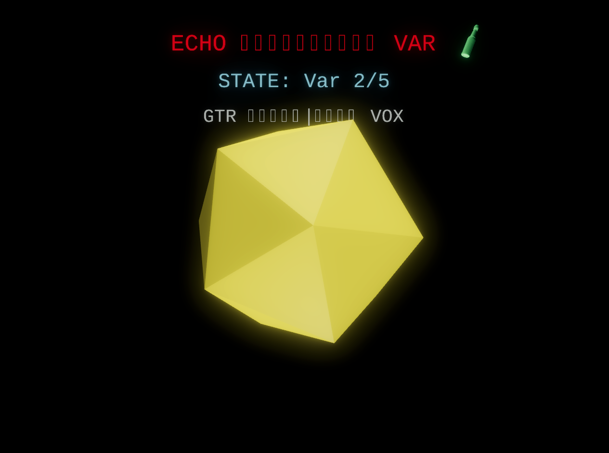
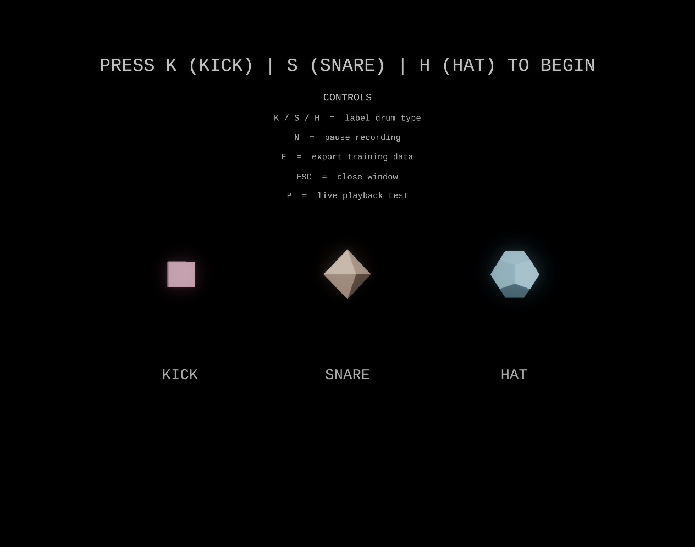
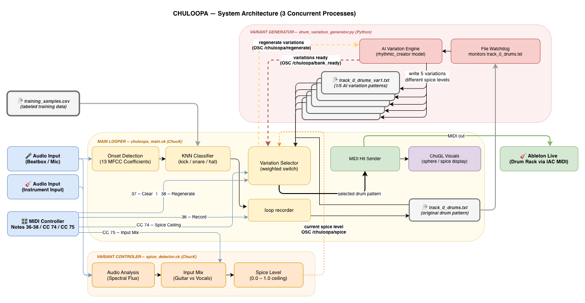

# CHULOOPA

**An intelligent drum looper that transforms beatbox into transcribed drum patterns with AI-powered variations.**

<p align="center">
  
  <br/>
  <em>Figure 1: CHULOOPA UI active state</em>
</p>

## Overview

CHULOOPA is a real-time drum looping system built in ChucK that uses machine learning to transcribe vocal beatboxing into drum patterns (kick, snare, hat). The system provides immediate audio feedback during recording, automatically exports symbolic drum data, generates AI-powered variations, and enables seamless pattern switching for live performance.

**Key Innovation:** Making drum programming accessible to amateur beatboxers through personalized ML classification combined with AI-powered pattern variations that maintain musical coherence.

### Core Features

- **Real-time Beatbox Transcription** — Vocal input → Drum samples (instant feedback)
- **KNN Classifier** — User-trainable, personalized drum detection (MFCC-13, k=3)
- **AI Variation Bank** — Local transformer-LSTM generates 5 variants at different spice levels
- **Audio-Driven Spice** — `spice_detector.ck` analyzes live audio and auto-selects variations at loop boundaries
- **OSC Integration** — Seamless Python-ChucK communication for automatic AI workflow
- **Ableton Live Routing** — MIDI output via macOS IAC Driver (Drum Rack, FX, mixing)
- **ChuGL Visualization** — Real-time color-coded shape feedback (drum hit impulses, spice slider, state text)

---

## Quick Start

### 1. Record Training Samples (One-time, ~5 minutes)

```bash
chuck src/drum_sample_recorder.ck
```

<p align="center">
  
  <br/>
  <em>Training UI — shapes pulse and brighten as samples accumulate</em>
</p>

**Controls:** K = kick, S = snare, H = hi-hat (10+ samples each), E = export, P = test playback, R = full reset, ESC = close

Record 10+ samples per class, press **E** to export, then **P** to verify accuracy. Re-record with **R** if classification sounds wrong. Creates `training_samples.csv`.

### 2. Start Python AI Engine (Terminal 1)

```bash
cd src
python drum_variation_generator.py --watch
```

Generates a bank of 5 variations at spice levels 0.2/0.4/0.6/0.8/1.0 using Jake Chen's rhythmic_creator model.

### 3. Start Spice Detector (Terminal 2)

```bash
cd src
chuck spice_detector.ck
```

Analyzes live audio and sends a composite spice level via OSC every 500ms. If your audio interface provides 2 channels, guitar/vocal mix control (CC 75) is enabled automatically.

### 4. Run CHULOOPA (Terminal 3)

```bash
cd src
chuck chuloopa_main.ck
```

> **DAW setup:** Any DAW receiving MIDI from IAC Driver Bus 1 will work. See [DAW Integration](#daw-integration) below for setup details.

### MIDI Controls

| Control                         | Action                                                                                   |
| ------------------------------- | ---------------------------------------------------------------------------------------- |
| **Note 36** (C1) — Press & Hold | Record track 0                                                                           |
| **Note 37** (C#1)               | Clear track 0                                                                            |
| **Note 38** (D1)                | Regenerate full variation bank                                                           |
| **CC 74**                       | Spice ceiling (0.0–1.0) — caps audio-driven spice                                        |
| **CC 75**                       | Input mix (0.0–1.0) — blends guitar vs. vocal input (requires 2-channel audio interface) |

Variation selection is **automatic** — `spice_detector.ck` streams audio energy every 500ms, and ChucK selects the best-matching variation at each loop boundary (rolling 4-bar window). CC 74 sets a ceiling on how high the spice can go.

---

## DAW Integration

```
ChucK (MidiOut) → IAC Driver Bus 1 → DAW MIDI Track → Drum Rack
```

### MIDI Note Mapping

| Drum   | MIDI Note | Pitch |
| ------ | --------- | ----- |
| Kick   | 36        | C1    |
| Snare  | 38        | D1    |
| Hi-hat | 42        | F#1   |

### macOS IAC Driver Setup (one-time)

1. Open **Audio MIDI Setup** → **Window → Show MIDI Studio**
2. Double-click **IAC Driver** → check **"Device is online"** → confirm Bus 1 exists → Apply

### DAW Setup

1. Create a **MIDI track** → input: **IAC Driver Bus 1** → Monitor: **In**
2. Load a drum instrument and assign pads: C1 → Kick, D1 → Snare, F#1 → Hi-hat

---

## Technical Architecture

<p align="center">
  
  <br/>
  <em>Figure 2: CHULOOPA system architecture</em>
</p>

### Pipeline

See system diagram above. In brief:

- **spice_detector.ck** analyzes live audio → sends `/chuloopa/spice` to **chuloopa_main.ck** every 500ms
- **drum_variation_generator.py** watches `track_0_drums.txt` → generates 5-variant bank (spice 0.2/0.4/0.6/0.8/1.0) → notifies ChucK via `/chuloopa/bank_ready`
- **chuloopa_main.ck** records beatbox → MFCC-13 KNN → Ableton MIDI → at loop boundary, selects best variant based on rolling 4-bar spice average (capped by CC 74 ceiling)

### OSC Messages

| Address                         | Direction              | Purpose                             |
| ------------------------------- | ---------------------- | ----------------------------------- |
| `/chuloopa/bank_ready`          | Python → ChucK         | All 5 variations ready              |
| `/chuloopa/variation_available` | Python → ChucK         | Index + spice of each ready variant |
| `/chuloopa/regenerate`          | ChucK → Python         | Request full bank regeneration      |
| `/chuloopa/spice`               | spice_detector → ChucK | Audio-driven spice (0.0–1.0)        |
| `/chuloopa/clear`               | ChucK → Python         | Track cleared                       |

**Ports:** ChucK → `localhost:5000`, Python → `127.0.0.1:5001` (use `127.0.0.1` — pythonosc doesn't resolve `localhost` reliably).

### ChuGL Visual Feedback

Shapes (cube / octahedron / dodecahedron / icosahedron) pulse on each drum hit and change color by state:

| Shape Color                  | State                                          |
| ---------------------------- | ---------------------------------------------- |
| Dim gray                     | Idle (no loop)                                 |
| Gray (blinking red text)     | Recording                                      |
| Dim gray                     | Muted (silence gate active)                    |
| Blue                         | Playing original loop                          |
| Blue-green tint              | Variation bank ready (not yet playing)         |
| Blue → Yellow → Red gradient | Playing a variation (color tracks spice level) |

**Spice slider** (`ECHO ━━━ VAR`): bar moves right as spice increases. Color: blue (low) → orange (mid) → red (high).

**State text** shows current mode: Idle / Recording / Echo / Var N/5 / Muted.

---

## File Structure

```
CHULOOPA/
├── src/
│   ├── chuloopa_main.ck              # MAIN: audio-driven spice + variation bank
│   ├── drum_variation_generator.py   # MAIN: variation bank engine (5 variants)
│   ├── spice_detector.ck             # MAIN: audio-driven spice → OSC
│   ├── drum_sample_recorder.ck       # Training data collector (run once)
│   ├── rhythmic_creator_model.py     # Transformer-LSTM variation model wrapper
│   ├── format_converters.py          # Drum pattern format conversion
│   └── tracks/track_0/
│       ├── track_0_drums.txt         # Original recording
│       └── variations/               # AI-generated variants (var1–var5)
│
├── samples/                          # kick.wav, snare.wav, hat.WAV
├── requirements.txt
└── training_samples.csv              # Generated on first recorder run
```

---

## Next Steps

**Phase 2 ✅ Complete (March 2026):** Offline AI variation bank, audio-driven spice, MFCC-13 KNN, OSC integration, weighted probabilistic selection, single-track workflow.

**Phase 3 — Multi-Track (Planned):**

- [ ] 3 simultaneous tracks with independent variation control
- [ ] Per-track spice levels and visual feedback (3 spheres)
- [ ] Cross-track variation coherence

---

## Dependencies

**ChucK:** 1.5.x+ with ChuGL support (STK included)

**Python 3.10+:**

```bash
pip install -r requirements.txt
```

Key packages: `python-osc`, `watchdog`, `torch`, `scikit-learn`, `numpy`

**Hardware:** MIDI controller with CC 74 knob, microphone

**Optional:** `GEMINI_API_KEY` for cloud-based variation alternative (`drum_variation_gemini.py`)

---

## Troubleshooting

**OSC not connecting:** Ensure all scripts run from `src/`. Check ports are free: `lsof -i :5000` and `lsof -i :5001`. Python must use `127.0.0.1` not `localhost`.

**DAW not receiving hits:** Confirm IAC Driver is online in Audio MIDI Setup. Set your DAW's MIDI track input to "IAC Driver Bus 1", Monitor: In.

**Poor classifier accuracy:** Re-record training samples with `drum_sample_recorder.ck` — delete `training_samples.csv` first, aim for 20+ samples per class with consistent technique.

**Variation bank not generating:** Verify `src/tracks/track_0/track_0_drums.txt` exists and PyTorch is installed. Check Python terminal for errors.

**Spice ceiling not responding:** Ensure `spice_detector.ck` is running (Terminal 2) and the ChuGL window is open.

---

## Credits

**Developer:** Paolo Sandejas  
**Institution:** CalArts — Music Technology MFA  
**Advisors:** Ajay Kapur, Jake Cheng  
**Year:** 2026

**AI Model:** rhythmic_creator by Jake Chen (Zhaohan Chen), CalArts MFA 2025 — "Music As Natural Language: Deep Learning Driven Rhythmic Creation" — Transformer-LSTM hybrid adapted for continuation-based loop variation.

**Inspired by:** Magenta's GrooVAE, Google Gemini API, Living Looper (nn_tilde), Intelligent Instruments Lab's Notochord
